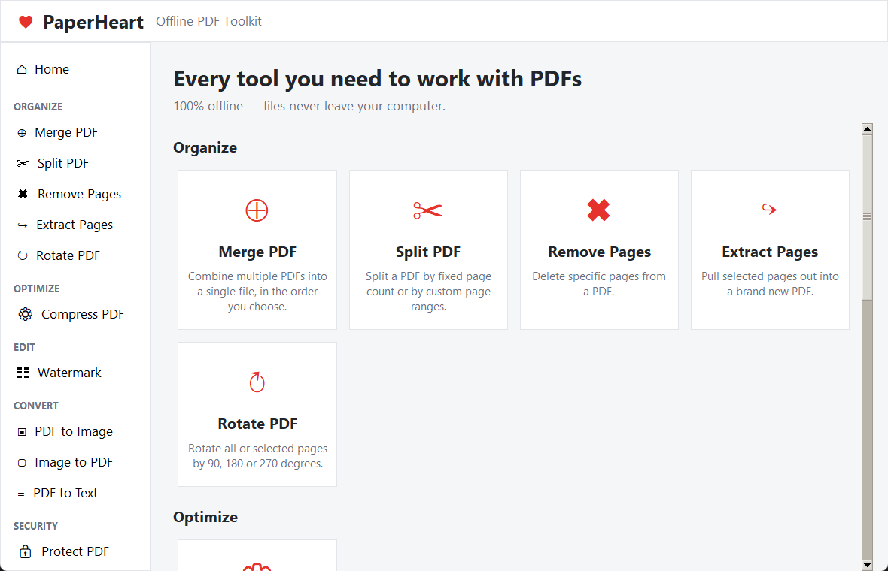
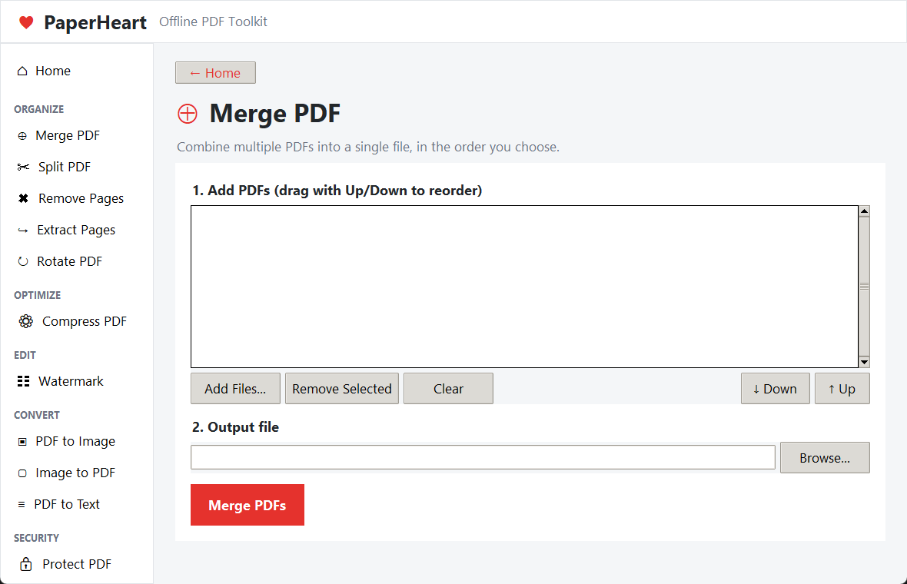
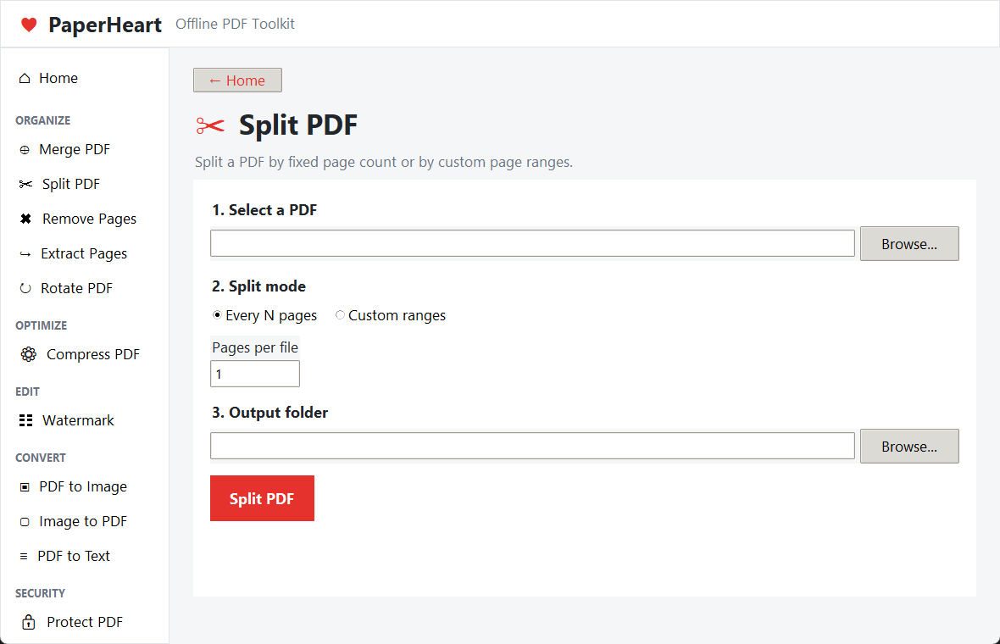
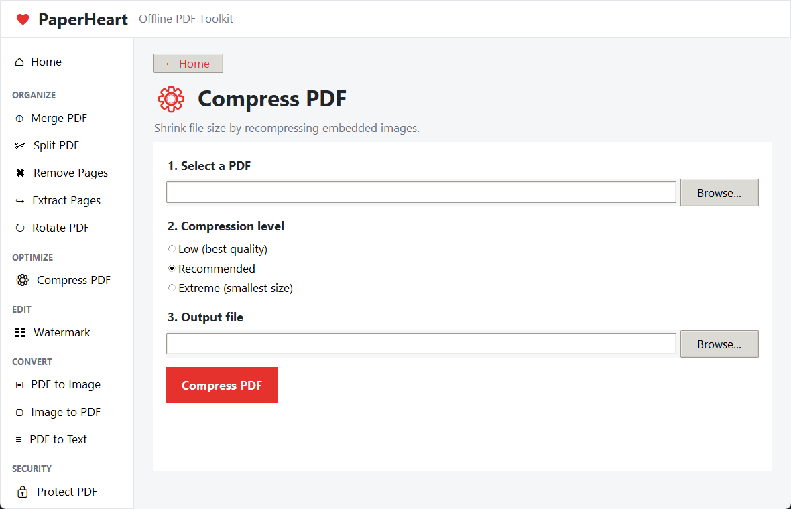
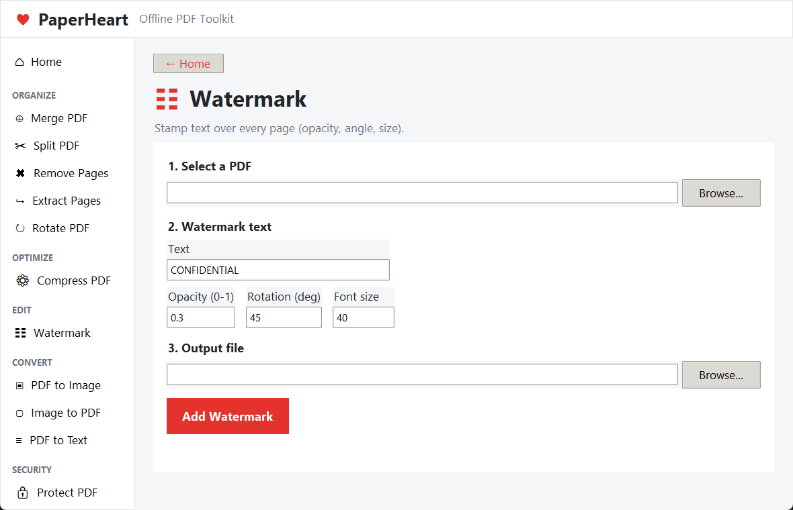
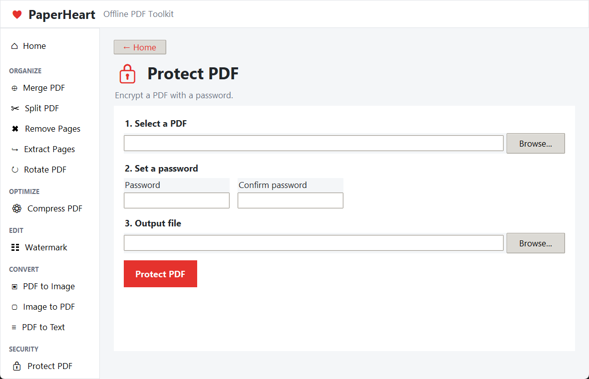
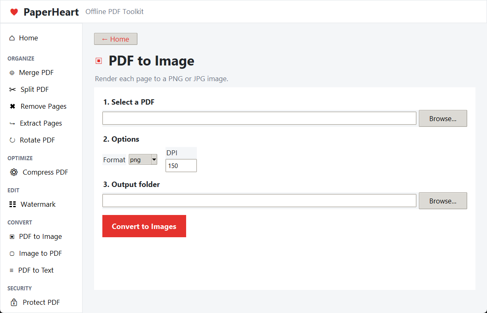

# 💗 PaperHeart

**A free, offline PDF toolkit for your desktop — inspired by [iLovePDF](https://www.ilovepdf.com), built with Python + Tkinter.**

PaperHeart gives you the same everyday PDF tools iLovePDF is known for — merge, split, compress, watermark, protect, and more — but everything runs **locally on your machine**. No account, no upload, no API key, no internet connection, and no file size limits. Your documents never leave your computer.



---

## Table of contents

- [Why PaperHeart?](#why-paperheart)
- [Features](#features)
- [Screenshots](#screenshots)
- [Get the app (no Python required)](#get-the-app-no-python-required)
- [Requirements (running from source)](#requirements-running-from-source)
- [Installation (running from source)](#installation-running-from-source)
- [Running the app](#running-the-app)
- [How to use each tool](#how-to-use-each-tool)
- [Project structure](#project-structure)
- [How it works under the hood](#how-it-works-under-the-hood)
- [Relationship to iLovePDF / ilovepdf-nodejs](#relationship-to-ilovepdf--ilovepdf-nodejs)
- [Limitations](#limitations)
- [Troubleshooting](#troubleshooting)
- [Roadmap ideas](#roadmap-ideas)
- [License](#license)

---

## Why PaperHeart?

Cloud tools like iLovePDF are great, but they come with tradeoffs: files are uploaded to a third-party server, free plans are rate-limited, and some tools sit behind a paywall. PaperHeart re-implements the most popular tools as a **local-first desktop app**:

- 🔒 **Private** — files are processed in memory/on disk on your machine only.
- ⚡ **No limits** — no daily task caps, no file size caps beyond your own disk/RAM.
- 🌐 **No internet required** — works on a plane, on a locked-down corporate network, anywhere.
- 🆓 **Free & open** — no subscription, no account.
- 🪶 **Lightweight** — pure Python, a single `pip install`, no browser or Electron runtime.

## Features

| Category  | Tool           | What it does                                                              |
|-----------|----------------|----------------------------------------------------------------------------|
| Organize  | **Merge PDF**      | Combine two or more PDFs into one, in an order you control.            |
| Organize  | **Split PDF**      | Split a PDF every *N* pages, or by custom page ranges (e.g. `1-3,4-6`). |
| Organize  | **Remove Pages**   | Delete specific pages from a PDF.                                      |
| Organize  | **Extract Pages**  | Pull selected pages out into a brand-new PDF.                          |
| Organize  | **Rotate PDF**     | Rotate all or selected pages by 90°, 180°, or 270°.                     |
| Optimize  | **Compress PDF**   | Shrink file size by recompressing/downscaling embedded images (Low / Recommended / Extreme presets). |
| Edit      | **Watermark**      | Stamp custom text over every page — control opacity, rotation angle, and font size. |
| Convert   | **PDF → Image**    | Render every page to a PNG or JPG at a chosen DPI.                      |
| Convert   | **Image → PDF**    | Combine one or more images (PNG/JPG/BMP/TIFF/WEBP) into a single PDF.  |
| Convert   | **PDF → Text**     | Extract all text content into a `.txt` file.                           |
| Security  | **Protect PDF**    | Encrypt a PDF with a password (AES-256).                               |
| Security  | **Unlock PDF**     | Remove password protection (you must know the password).               |

Every tool runs on a background thread so the UI never freezes, shows a progress indicator while working, and offers to open the output folder as soon as it's done.

## Screenshots

<table>
<tr>
<td width="50%">

**Home — every tool at a glance**


</td>
<td width="50%">

**Merge PDF**


</td>
</tr>
<tr>
<td width="50%">

**Split PDF**


</td>
<td width="50%">

**Compress PDF**


</td>
</tr>
<tr>
<td width="50%">

**Watermark**


</td>
<td width="50%">

**Protect PDF**


</td>
</tr>
<tr>
<td width="50%">

**PDF → Image**


</td>
<td width="50%">

</td>
</tr>
</table>

## Get the app (no Python required)

PaperHeart can be built into a single **`PaperHeart.exe`** for Windows — no Python installation, no dependencies, nothing to configure. Just double-click it.

```bat
build_exe.bat
```

This script:
1. Creates an isolated `.buildvenv` virtual environment (so the exe only bundles PaperHeart's own dependencies, not anything else you happen to have installed globally).
2. Installs `PyMuPDF`, `Pillow`, and `PyInstaller` into it.
3. Runs PyInstaller to produce **`dist\PaperHeart.exe`** (~38 MB, single file, includes the app icon).

Once built, `dist\PaperHeart.exe` is fully standalone — copy it anywhere (a USB stick, another PC, a shared drive) and run it with no install step. To make it feel like an installed app, right-click it → *Send to* → *Desktop (create shortcut)*, or pin it to Start/Taskbar.

> Prefer a proper installer with a Start Menu entry and an uninstaller instead of a portable .exe? The app can also be packaged with [Inno Setup](https://jrsoftware.org/isinfo.php) into a `PaperHeartSetup.exe` wizard — ask if you'd like that added.

## Requirements (running from source)

- **Python 3.10+** (tested on 3.14)
- **Windows, macOS, or Linux** with Tkinter available (Tkinter ships with the standard python.org installer on Windows/macOS; on Linux install `python3-tk` via your package manager if it's missing)
- Two pip packages — see below

## Installation (running from source)

```bash
# 1. Clone or download this folder
cd ilovepdf

# 2. (Recommended) create a virtual environment
python -m venv .venv
.venv\Scripts\activate        # Windows
source .venv/bin/activate     # macOS/Linux

# 3. Install dependencies
pip install -r requirements.txt
```

`requirements.txt` installs:

- [`PyMuPDF`](https://pymupdf.readthedocs.io/) — reads, writes, renders, and edits PDFs (merge, split, rotate, watermark, encrypt, render-to-image, text extraction).
- [`Pillow`](https://python-pillow.org/) — image decoding/encoding for compression and image ↔ PDF conversion.

## Running the app

```bash
python main.py
```

A window titled **"PaperHeart — Offline PDF Toolkit"** opens. Pick a tool from the sidebar or click a card on the home screen, fill in the form, and click the red action button.

## How to use each tool

1. **Merge PDF** — click *Add Files…*, select two or more PDFs, use *↑ Up / ↓ Down* to set the final order, choose an output file, click **Merge PDFs**.
2. **Split PDF** — pick a PDF, choose *Every N pages* (e.g. `2` → files of 2 pages each) or *Custom ranges* (e.g. `1-3,4-6,7` → one output file per group), pick an output folder, click **Split PDF**.
3. **Remove / Extract Pages** — pick a PDF (the page count appears automatically), type the pages to remove/keep as `2,4-6`, choose an output file, run.
4. **Rotate PDF** — pick a PDF, choose 90°/180°/270°, optionally restrict to specific pages (blank = all pages), run.
5. **Compress PDF** — pick a PDF and a quality preset (*Low* keeps the most quality, *Extreme* gives the smallest file), run. The app reports the size before/after and the % saved.
6. **Watermark** — pick a PDF, type the watermark text, tune opacity (`0`–`1`), rotation (degrees), and font size, run.
7. **PDF → Image** — pick a PDF, choose PNG or JPG and a DPI (150 is a good default, 300 for print quality), pick an output folder, run.
8. **Image → PDF** — add images in the order you want them to appear as pages, choose an output file, run.
9. **PDF → Text** — pick a PDF (enter its password if it's protected), choose an output `.txt` file, run.
10. **Protect PDF** — pick a PDF, set and confirm a password, run. The file is encrypted with AES-256.
11. **Unlock PDF** — pick a protected PDF, enter its current password, run — the output is a password-free copy.

## Project structure

```
ilovepdf/
├── main.py               # Entry point — creates the Tk app and starts the mainloop
├── ui.py                 # All Tkinter UI: theme, sidebar, home grid, and one page per tool
├── core.py               # All PDF logic (pure functions, no UI) — merge/split/compress/etc.
├── requirements.txt      # PyMuPDF + Pillow
├── build_exe.bat         # Builds dist\PaperHeart.exe in an isolated venv (see above)
├── PaperHeart.spec       # PyInstaller build spec (generated by build_exe.bat)
├── assets/
│   └── paperheart.ico    # App icon (window/taskbar icon + exe icon)
├── docs/
│   └── screenshots/      # Screenshots used in this README
├── dist/                 # Build output — PaperHeart.exe lands here (not committed to git)
└── README.md
```

The split between `core.py` and `ui.py` is deliberate: every PDF operation is a plain, testable Python function that takes file paths in and writes a file path out — the UI just wires forms to those functions and runs them off the main thread.

## How it works under the hood

- **PDF engine:** [PyMuPDF](https://pymupdf.readthedocs.io/) (`pymupdf`, imported as `fitz`) handles all real PDF manipulation — page insertion/deletion, rotation, rendering to raster images, text extraction, and AES-256 encryption/decryption.
- **Images:** [Pillow](https://python-pillow.org/) re-encodes embedded images (for compression) and converts source images to the JPEG streams embedded into new PDFs (for Image → PDF).
- **Concurrency:** each "Run" button spawns a `threading.Thread`; results/errors are marshaled back to the Tk main thread via `Widget.after(0, …)`, which is the safe way to touch Tk widgets from a background thread.
- **Compression strategy:** PaperHeart doesn't just re-zip the PDF — it walks every embedded image object, decodes it with Pillow, downsamples it to a max dimension, and re-encodes it as a quality-tuned JPEG before saving the PDF with stream deflation and garbage collection enabled. This is the same lever iLovePDF's compressor pulls for "Recommended"/"Extreme" presets.
- **Packaging:** [PyInstaller](https://pyinstaller.org/) freezes `main.py` plus the Python interpreter, Tkinter/Tcl, PyMuPDF, and Pillow into one `.exe`. `ui.py` resolves the bundled icon through a small `resource_path()` helper that checks `sys._MEIPASS` (the temp folder PyInstaller extracts into at runtime) so the same code works both `python main.py` and as a frozen exe.

## Relationship to iLovePDF / ilovepdf-nodejs

This project takes **feature inspiration** from [ilovepdf.com](https://www.ilovepdf.com) and its official [`ilovepdf-nodejs`](https://github.com/ilovepdf/ilovepdf-nodejs) SDK — that SDK is a Node.js client for iLovePDF's **paid cloud REST API** (it needs a public/secret API key pair and an internet connection, and usage is metered by iLovePDF).

PaperHeart is an independent, from-scratch Python/Tkinter application. It does **not** call iLovePDF's API, use their SDK, or bundle any of their code/branding — it reimplements an equivalent tool set using local, open-source libraries so it can run fully offline for free. "PaperHeart" and its heart icon are this project's own identity, chosen specifically to avoid any confusion with the iLovePDF product or brand.

## Limitations

- **Compression** is image-focused: PDFs that are mostly vector graphics or text won't shrink much (there isn't much to recompress). Scanned-document PDFs (mostly photos) shrink the most.
- **Watermark** is text-only for now — no image/logo stamping yet.
- **No OCR** — "PDF → Text" extracts existing text layers; it won't read text out of scanned/image-only pages.
- **No drag-and-drop** — Tkinter has no built-in cross-platform drag-and-drop, so files are added via the *Add Files…* dialog instead.
- Tested primarily on **Windows**; it should run on macOS/Linux with Tkinter installed, but hasn't been verified there.

## Troubleshooting

- **`ModuleNotFoundError: No module named 'tkinter'`** (Linux) — install it via your package manager, e.g. `sudo apt install python3-tk`.
- **"This PDF is password protected" error** on a tool that doesn't ask for a password — unlock the PDF first with the **Unlock PDF** tool, then re-run the other tool on the unlocked copy.
- **Compress didn't shrink the file much** — the PDF likely has few/no raster images (see [Limitations](#limitations)); try a scanned/photo-heavy PDF to see a bigger effect, or use the *Extreme* preset.
- **App window looks tiny/blurry on a high-DPI display** — this is a Windows display-scaling quirk in some Tk builds; try setting Windows display scaling to 100% for this app, or resize the window (it's fully resizable, minimum 960×620).

## Roadmap ideas

- [ ] Image/logo watermarks in addition to text
- [ ] PDF page reordering/preview thumbnails
- [ ] Basic OCR for scanned PDFs
- [ ] Drag-and-drop file support (via `tkinterdnd2`)
- [ ] Optional "Cloud mode" that calls the real iLovePDF API when the user supplies their own API keys, for tools not implemented locally

## License

No license has been set for this project yet — add one (e.g. MIT) if you plan to share or publish it.
